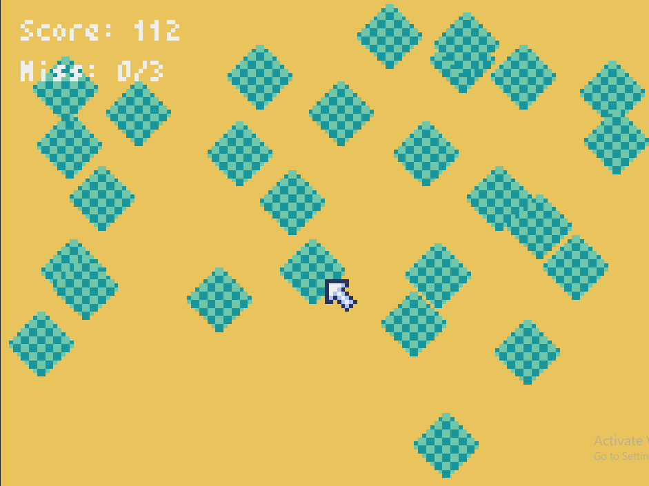

# Kliktupat

A game where you catch ketupat by clicking with the cursor. Made using Pyxel


## Features
- Catch the ketupat (that's the core of the game)
- Game speed gradually increases every +10 score.
- Miss when you don't click the ketupat.
- Game over when Miss : 3
- Show your last score when game over
- BGM (Background Music) created using built in Pyxel editor


## Demo
You can download the game from demo directory of this repository. Or if you want to build this game, you can follow steps below.


## Requirement

- Python 3.x
- Pyxel and Pyinstaller


## Build for yourself
Install packages
```sh
pip install pyxel pyinstaller
```
Create new directory
```sh
mkdir base
cd base
```
Create another new directory for build output
```sh
mkdir pc
mkdir web
```
You can skip one of the directories if you only want to build for pc or web.

Clone this repository or download the source code

Make pyxel package
```sh
pyxel package kliktupat .\kliktupat\game.py
```

Then, make executable for windows or mac (depends on your os)
```sh
cd pc
pyxel app2exe ../kliktupat.pyxapp
```

For web
```sh
pyxel app2html ../kliktupat.pyxapp
```

## Future Plan
- Recreate this game using Godot