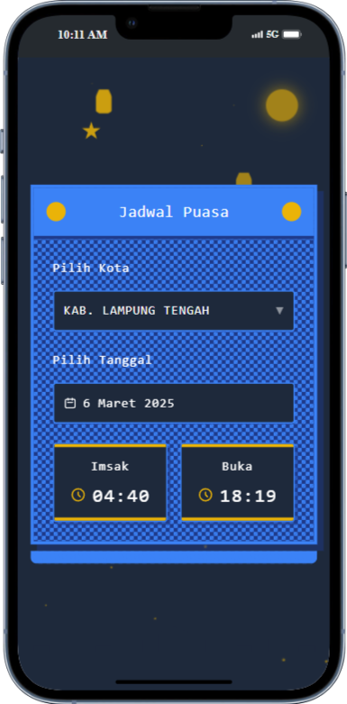

# Jadwal Ramadan - Aplikasi Jadwal Imsak dan Buka Puasa [🔗preview](https://jadwal-puasa.netlify.app/)

{: height="200px" style="display: block; margin: 0 auto;"}

Aplikasi web dengan tema retro untuk menampilkan jadwal waktu imsak dan buka puasa (maghrib) selama bulan Ramadan. Aplikasi ini mengambil data dari API MyQuran untuk menampilkan jadwal yang akurat berdasarkan kota dan tanggal yang dipilih.

## 🌙 Fitur Utama

- **Tema Ramadan Retro** - Desain dengan nuansa Ramadan yang kental namun tetap mempertahankan gaya retro
- **Pencarian Kota** - Dropdown dengan fitur pencarian untuk memilih kota di seluruh Indonesia
- **Pemilih Tanggal** - Kalender interaktif untuk memilih tanggal
- **Tampilan Waktu** - Menampilkan waktu imsak dan buka puasa (maghrib) dengan jelas
- **Responsif** - Tampilan yang responsif dan dapat diakses dari berbagai perangkat
- **Elemen Dekoratif** - Bulan, bintang, dan siluet masjid yang memberikan nuansa Ramadan
- **Animasi** - Efek berkedip pada elemen langit untuk memberikan kesan dinamis

## 🚀 Teknologi yang Digunakan

- HTML5
- CSS3 dengan Tailwind CSS
- JavaScript (Vanilla JS)
- API MyQuran untuk data jadwal sholat

## 📋 Prasyarat

- Browser web modern (Chrome, Firefox, Safari, Edge)
- Koneksi internet untuk mengakses API
